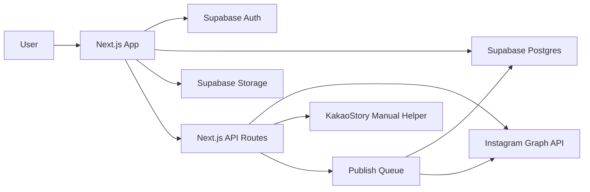

# CrossPosting

Instagram과 KakaoStory에 작성한 게시물의 사진, 문구, 해시태그, 링크를 다른 SNS 채널에 재사용할 수 있도록 돕는 크로스포스팅 워크스페이스입니다.

> 핵심 원칙: 플랫폼 약관을 우회하지 않는다. 공식 API로 가능한 자동 발행은 자동화하고, 공식 API가 불명확하거나 제한적인 채널은 사용자가 검수한 뒤 수동 게시할 수 있는 보조 플로우로 제공한다.

## 1. 문제 정의

소상공인, 크리에이터, 브랜드 운영자는 같은 게시물을 Instagram, KakaoStory, 블로그, 커뮤니티 등에 반복해서 올립니다. 하지만 매번 사진을 다시 내려받고 문구를 복사하고 채널별 제한에 맞춰 수정하는 과정이 번거롭습니다.

CrossPosting은 하나의 원본 게시물을 기반으로 여러 채널용 게시 초안을 만들고, 가능한 채널에는 공식 API로 발행하며, 제한된 채널에는 복사/다운로드/체크리스트 기반의 안전한 수동 게시 경험을 제공합니다.

## 2. 제품 목표

- 사용자가 이미 작성한 게시물의 사진과 글 내용을 하나의 콘텐츠 카드로 가져온다.
- 채널별 글자 수, 이미지 규격, 해시태그, 링크 정책에 맞춰 게시 초안을 자동 변환한다.
- 공식 API가 허용하는 범위 안에서 예약 발행 또는 즉시 발행을 지원한다.
- API 제약이 있는 채널은 원클릭 복사, 이미지 다운로드, 게시 가이드로 전환 비용을 낮춘다.
- 모든 게시 이력, 실패 사유, 재시도 상태를 추적한다.

## 3. MVP 범위

### In Scope

- 이메일 로그인 및 OAuth 계정 연결
- Supabase 기반 사용자, 채널, 게시물, 미디어, 발행 작업 저장
- Instagram Professional 계정 게시물 가져오기
- Instagram Professional 계정 대상 이미지/캡션 발행 초안 및 발행 작업
- KakaoStory 대상 수동 게시 보조 플로우
- 원본 게시물에서 채널별 초안 생성
- 이미지 저장, 썸네일 미리보기, 캡션 편집
- 게시 전 검수 화면
- 발행 이력, 실패 로그, 재시도

### Out of Scope

- 비공식 스크래핑, 브라우저 자동 입력, 약관 우회 자동화
- 개인 Instagram 계정 자동 발행
- 모든 SNS 동시 지원
- AI 자동 문구 생성 고도화
- 팀 협업, 승인 워크플로우, 고객사별 권한 모델

## 4. 플랫폼 정책 메모

### Instagram

Instagram 공식 Content Publishing 흐름은 Instagram Professional 계정을 대상으로 이미지, 영상, 릴스, 캐러셀 게시를 지원합니다. 사용자는 Facebook Page와 연결된 Instagram Professional 계정, 적절한 권한, 장기 토큰이 필요합니다.

제품 설계상 Instagram은 `공식 API 자동 발행 가능 채널`로 분류합니다.

### KakaoStory

Kakao Developers의 현재 공개 문서 중심 제품군은 Kakao Login, Kakao Talk Share, Message, Channel, Business API 등에 집중되어 있습니다. KakaoStory에 임의 게시물을 직접 자동 발행하는 공개 API는 MVP의 확실한 전제로 두지 않습니다.

제품 설계상 KakaoStory는 `수동 게시 보조 채널`로 분류합니다. 즉, 앱에서 사진을 내려받고 본문을 복사해 사용자가 KakaoStory 앱 또는 웹에서 직접 게시하도록 돕습니다.

## 5. 대상 사용자

- 1인 사업자: 인스타그램에 올린 신상품 게시물을 다른 채널에도 빠르게 재활용하고 싶다.
- 로컬 매장 운영자: 이벤트 공지 사진과 문구를 여러 SNS에 반복 게시한다.
- 크리에이터: 촬영물과 긴 캡션을 채널별 형식에 맞춰 다듬고 싶다.
- 마케터: 게시 이력과 실패 여부를 한 화면에서 관리하고 싶다.

## 6. 핵심 사용자 시나리오

1. 사용자가 CrossPosting에 로그인한다.
2. Instagram 계정을 연결한다.
3. 최근 Instagram 게시물을 불러온다.
4. 게시물 하나를 선택해 크로스포스팅 초안을 생성한다.
5. 대상 채널을 선택한다.
6. 앱이 채널별 이미지/본문 제약을 검사한다.
7. 사용자가 문구와 이미지를 검수한다.
8. Instagram 대상은 공식 API로 발행하거나 예약한다.
9. KakaoStory 대상은 본문 복사, 이미지 다운로드, 게시 체크리스트를 제공한다.
10. 게시 결과와 이력을 저장한다.

## 7. 주요 화면

- Dashboard: 연결된 채널, 최근 게시물, 발행 상태 요약
- Source Posts: 가져온 원본 게시물 목록
- Composer: 원본 기반 채널별 초안 편집
- Preview: Instagram, KakaoStory 스타일 미리보기
- Publish Queue: 즉시 발행, 예약, 실패, 재시도 작업
- Settings: OAuth 연결, 토큰 상태, Supabase 프로필

## 8. 기술 스택

- Framework: Next.js App Router
- Language: TypeScript
- UI: React, Tailwind CSS, shadcn/ui
- State: React Hook Form, TanStack Query
- Backend: Next.js Route Handlers, Server Actions
- Database: Supabase Postgres
- Auth: Supabase Auth
- Storage: Supabase Storage
- Jobs: Vercel Cron 또는 Supabase Edge Functions
- Validation: Zod
- Testing: Vitest, React Testing Library, Playwright
- Observability: Supabase logs, Sentry

## 9. 아키텍처 개요



## 10. 데이터 모델 초안

- `profiles`: 사용자 프로필
- `social_accounts`: 연결된 SNS 계정과 토큰 메타데이터
- `source_posts`: 원본 게시물
- `media_assets`: 원본 및 변환 이미지 파일
- `post_drafts`: 채널별 게시 초안
- `publish_jobs`: 발행 작업과 상태
- `publish_logs`: 외부 API 요청/응답 요약, 실패 원인

자세한 스키마는 [docs/DATABASE.md](docs/DATABASE.md)를 참고하세요.

## 11. 제품 원칙

- 게시 전 사용자가 항상 최종 내용을 확인한다.
- 플랫폼별 제약을 숨기지 않고 UI에서 명확히 안내한다.
- 자동화보다 계정 안전성과 장기 운영 가능성을 우선한다.
- 원본 콘텐츠와 변환 초안을 분리해 추적 가능하게 만든다.
- 실패 상태는 사용자가 이해하고 다시 시도할 수 있는 언어로 보여준다.

## 12. 개발 로드맵

### Phase 0. Discovery

- Instagram, KakaoStory API 가능 범위 검증
- 앱 등록, OAuth 권한, 심사 요구사항 확인
- 초기 사용자 5명 인터뷰

### Phase 1. MVP Foundation

- Next.js 프로젝트 세팅
- Supabase Auth, DB, Storage 연결
- 기본 대시보드와 게시물 목록 구현
- Instagram 계정 연결 및 게시물 가져오기

### Phase 2. Composer

- 원본 게시물 선택
- 채널별 초안 생성
- 이미지 미리보기와 본문 편집
- KakaoStory 수동 게시 보조 기능

### Phase 3. Publishing

- Instagram 발행 작업 생성
- 발행 상태 추적
- 실패 재시도
- 예약 발행 베타

### Phase 4. Beta

- 온보딩 개선
- 에러 메시지 정리
- 사용량 제한과 요금제 초안
- 운영 지표 대시보드

## 13. 성공 지표

- 첫 게시물 초안 생성까지 걸리는 시간 3분 이하
- 초안 생성 후 게시 완료율 60% 이상
- 게시 실패 후 원인 확인 가능률 95% 이상
- 주간 활성 사용자당 평균 재사용 게시물 3개 이상
- 수동 복사 플로우 이탈률 30% 이하

## 14. 보안과 컴플라이언스

- OAuth 토큰은 서버에서만 취급한다.
- Supabase Row Level Security를 모든 사용자 데이터 테이블에 적용한다.
- 외부 API 응답 전문을 장기 보관하지 않는다.
- 미디어 파일은 사용자별 경로와 signed URL로 보호한다.
- 자동 게시 기능은 공식 API와 권한 범위 안에서만 제공한다.

## 15. 로컬 개발 예상 명령어

```bash
npm install
npm run dev
npm run lint
npm run test
```

## 16. 환경 변수

`.env.example`을 기준으로 `.env.local`을 구성합니다.

```bash
NEXT_PUBLIC_SUPABASE_URL=
NEXT_PUBLIC_SUPABASE_ANON_KEY=
SUPABASE_SERVICE_ROLE_KEY=
INSTAGRAM_APP_ID=
INSTAGRAM_APP_SECRET=
INSTAGRAM_REDIRECT_URI=
SENTRY_DSN=
```

## 17. 의사결정이 필요한 항목

- 첫 자동 발행 대상 SNS를 Instagram으로 고정할지
- KakaoStory를 수동 게시 보조로 출시할지, API 검증 완료까지 보류할지
- 예약 발행을 MVP에 포함할지
- 콘텐츠 변환에 AI 문구 추천을 넣을지
- 개인 사용자용 무료 플랜과 사업자용 유료 플랜을 어떻게 나눌지

## 18. 참고 문서

- [Product Requirements](docs/PRD.md)
- [Architecture](docs/ARCHITECTURE.md)
- [Database](docs/DATABASE.md)
- [Risk Register](docs/RISK_REGISTER.md)
- [Roadmap](docs/ROADMAP.md)
