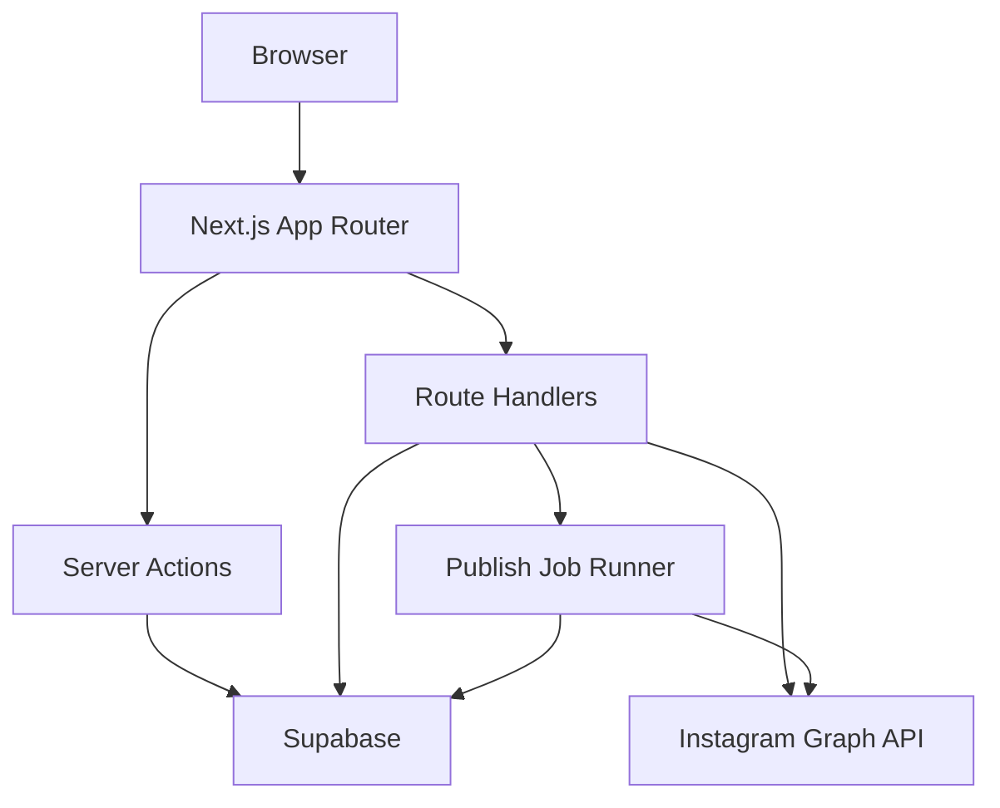
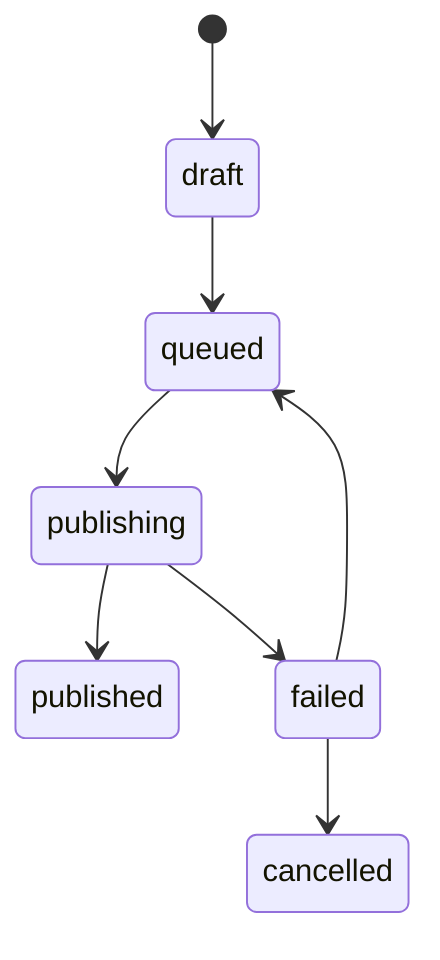

# Architecture

## 시스템 개요

CrossPosting은 Next.js App Router를 중심으로 UI, 서버 액션, API 라우트를 구성하고 Supabase를 인증, 데이터베이스, 파일 저장소로 사용합니다. 외부 SNS API와 통신하는 코드는 서버 전용 모듈에 배치합니다.



## 디렉터리 구조 제안

```text
src/
  app/
    (auth)/
    (dashboard)/
    api/
  components/
    ui/
    composer/
    social-account/
    publish/
  hooks/
  lib/
    supabase/
    instagram/
    publishing/
    validation/
  server/
    actions/
    jobs/
  types/
supabase/
  migrations/
  seed.sql
docs/
```

## 프론트엔드 설계

- Next.js App Router의 서버 컴포넌트를 기본으로 사용합니다.
- 입력과 편집이 많은 Composer는 클라이언트 컴포넌트로 분리합니다.
- shadcn/ui는 Form, Dialog, Tabs, Toast, Table, Dropdown Menu 중심으로 사용합니다.
- Tailwind CSS는 디자인 토큰과 상태 표현에 집중합니다.
- TanStack Query는 외부 API 상태와 비동기 작업 갱신에 사용합니다.
- React Hook Form과 Zod로 초안 편집 폼을 검증합니다.

## 백엔드 설계

- Supabase Auth 세션은 서버에서 검증합니다.
- SNS 토큰 처리와 발행 요청은 Route Handler 또는 Server Action에서만 수행합니다.
- 발행 작업은 `publish_jobs`에 먼저 저장한 뒤 워커가 처리합니다.
- 워커는 Vercel Cron, Supabase Edge Functions, 또는 서버리스 큐로 시작합니다.
- 외부 API 실패는 재시도 가능한 실패와 사용자 조치가 필요한 실패로 구분합니다.

## 외부 API 모듈

### Instagram

책임:

- OAuth callback 처리
- 장기 토큰 저장
- 연결 계정 정보 조회
- 원본 게시물 조회
- 미디어 컨테이너 생성
- 컨테이너 발행
- API 오류 표준화

### KakaoStory

MVP 책임:

- 자동 발행 API 연동 없음
- 수동 게시용 이미지 패키지 생성
- 본문 클립보드 복사 지원
- 게시 체크리스트 제공

## 발행 상태 머신



## 에러 분류

- `AUTH_REQUIRED`: 재로그인 필요
- `TOKEN_EXPIRED`: SNS 토큰 갱신 필요
- `PERMISSION_MISSING`: 앱 권한 또는 계정 유형 문제
- `MEDIA_INVALID`: 이미지 규격 문제
- `RATE_LIMITED`: API 사용량 제한
- `PLATFORM_UNAVAILABLE`: 외부 플랫폼 장애
- `UNKNOWN`: 분류되지 않은 실패

## 보안 설계

- Service Role Key는 서버 환경 변수로만 사용합니다.
- 사용자 데이터는 RLS로 격리합니다.
- SNS 토큰은 암호화 저장을 권장합니다.
- API 로그에는 토큰, 원본 전체 응답, 개인정보를 저장하지 않습니다.
- Storage 파일은 private bucket과 signed URL을 사용합니다.

## 테스트 전략

- Unit: caption parser, channel constraint validator, error mapper
- Integration: Supabase repository, Instagram client mock
- E2E: login, import, draft creation, manual publish helper
- Contract: Instagram API 응답 fixture 기반 파싱 테스트

## 관측성

- Sentry: 클라이언트/서버 예외
- Supabase logs: DB 및 Edge Function 오류
- `publish_logs`: 사용자에게 노출 가능한 발행 실패 요약
- 운영 대시보드: 발행 성공률, 실패 유형, 토큰 만료 수
