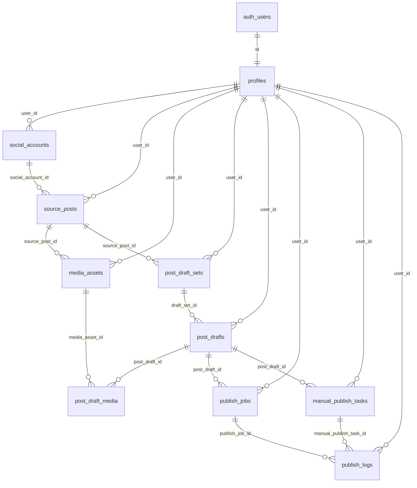

# CrossPosting DB Design

## 1. 목적과 현재 상태

이 문서는 회원가입, SNS 계정 연결, 원본 게시글 가져오기, 채널별 초안 생성, 수동 게시 보조, 발행 이력 구현 전에 Claude가 참고해야 할 DB 기준 문서입니다.

현재 구현 상태:

- Google OAuth 로그인 UI와 callback route가 구현되어 있습니다.
- `/dashboard`는 placeholder이며, 실제 데이터 UI는 아직 없습니다.
- `supabase/migrations/`에는 실제 DB migration이 없습니다.
- `src/types/database.types.ts`는 빈 public schema 기준으로 생성된 scaffold입니다.
- 이 문서가 상세 DB 기준이며, 기존 `docs/DATABASE.md`는 짧은 초안으로 유지합니다.

핵심 원칙:

- 모든 사용자 소유 데이터는 `user_id`를 갖고 `profiles(id)`를 참조합니다.
- 모든 application table은 RLS를 활성화합니다.
- SNS token과 secret은 서버 전용으로 암호화 저장하고 client bundle이나 log에 노출하지 않습니다.
- 원본 콘텐츠, 채널별 초안, 자동 발행 작업, 수동 게시 작업을 분리합니다.
- MVP는 개인 사용자 단위입니다. team/workspace 권한 모델은 넣지 않습니다.

## 2. 제품 흐름 기준 도메인 모델

CrossPosting의 MVP 흐름은 다음 순서로 모델링합니다.

1. 사용자가 Supabase Auth로 로그인합니다.
2. `profiles` row가 자동 생성됩니다.
3. 사용자가 Instagram 계정을 연결합니다.
4. Instagram 게시글을 `source_posts`와 `media_assets`로 가져옵니다.
5. 원본 게시글 하나를 기준으로 `post_draft_sets` 작업 묶음을 만듭니다.
6. Instagram, LINE Band, KakaoStory 대상 `post_drafts`를 생성합니다.
7. Instagram draft는 `publish_jobs`를 통해 공식 API 발행 흐름으로 보냅니다.
8. LINE Band/KakaoStory draft는 `manual_publish_tasks`를 통해 복사, 이미지 다운로드, 게시 완료 체크를 지원합니다.
9. 자동/수동 흐름의 사용자 표시용 이력은 `publish_logs`에 남깁니다.

## 3. 혼합형 플랫폼 정책

플랫폼별 정책은 MVP에서 고정합니다.

| Platform | DB value | MVP mode | 정책 |
|---|---|---|---|
| Instagram | `instagram` | API channel | 공식 API 계정 연결, source import, 자동 발행 job 대상 |
| LINE Band | `line_band` | Manual helper | 토큰 저장/자동 발행 없이 복사·붙여넣기 보조 |
| KakaoStory | `kakaostory` | Manual helper | 토큰 저장/자동 발행 없이 복사·붙여넣기 보조 |

중요:

- LINE Band/KakaoStory는 MVP에서 `social_accounts` token 저장 대상이 아닙니다.
- LINE Band/KakaoStory는 UI와 문서에서 "수동 게시 보조"로만 표현합니다.
- Instagram 자동 발행은 공식 Graph API 범위에서만 구현합니다.
- 나중에 LINE Band/KakaoStory 공식 API가 검증되면 `provider`/`target_channel` enum과 계정 연결 정책을 확장합니다.

## 4. ERD 개요



## 5. 테이블별 설계

### `profiles`

Supabase `auth.users`와 1:1로 연결되는 application profile입니다. 회원가입 또는 OAuth 최초 로그인 후 trigger나 server action으로 자동 생성합니다.

주요 컬럼:

| Column | Type | Required | 설명 |
|---|---|---|---|
| `id` | `uuid` | yes | PK, `auth.users(id)` FK |
| `display_name` | `text` | no | 사용자 표시 이름 |
| `avatar_url` | `text` | no | OAuth profile image 또는 직접 설정 이미지 |
| `onboarding_status` | `text` | yes | `pending`, `completed` |
| `created_at` | `timestamptz` | yes | 생성 시각 |
| `updated_at` | `timestamptz` | yes | 수정 시각 |

키/제약:

- PK: `id`
- FK: `id references auth.users(id) on delete cascade`
- check: `onboarding_status in ('pending', 'completed')`

### `social_accounts`

Instagram처럼 공식 API 연동이 필요한 외부 계정을 저장합니다. MVP에서는 Instagram만 저장합니다.

주요 컬럼:

| Column | Type | Required | 설명 |
|---|---|---|---|
| `id` | `uuid` | yes | PK |
| `user_id` | `uuid` | yes | `profiles(id)` FK |
| `provider` | `text` | yes | MVP에서는 `instagram` |
| `provider_account_id` | `text` | yes | Instagram business/professional account id |
| `display_name` | `text` | no | 계정 표시 이름 |
| `account_type` | `text` | no | business, creator 등 |
| `access_token_encrypted` | `text` | no | 서버 전용 암호화 token |
| `refresh_token_encrypted` | `text` | no | provider가 refresh token을 줄 때만 사용 |
| `token_expires_at` | `timestamptz` | no | token 만료 시각 |
| `scopes` | `text[]` | yes | 부여된 권한 목록 |
| `status` | `text` | yes | 연결 상태 |
| `created_at` | `timestamptz` | yes | 생성 시각 |
| `updated_at` | `timestamptz` | yes | 수정 시각 |

키/제약:

- PK: `id`
- FK: `user_id references profiles(id) on delete cascade`
- unique: `(user_id, provider, provider_account_id)`
- check: `provider in ('instagram')` for MVP
- check: `status in ('active', 'expired', 'revoked', 'error')`

주의:

- LINE Band/KakaoStory token을 여기에 저장하지 않습니다.
- token 원문, provider raw response 전체, 개인정보가 많은 payload는 log에 저장하지 않습니다.

### `source_posts`

원본 콘텐츠를 저장합니다. Instagram API에서 가져온 게시글과 사용자가 직접 입력한 원본 콘텐츠를 모두 수용합니다.

주요 컬럼:

| Column | Type | Required | 설명 |
|---|---|---|---|
| `id` | `uuid` | yes | PK |
| `user_id` | `uuid` | yes | `profiles(id)` FK |
| `social_account_id` | `uuid` | no | API import인 경우 `social_accounts(id)` |
| `source_type` | `text` | yes | `api_import`, `manual_input` |
| `provider` | `text` | no | API import이면 `instagram`; manual이면 원본 출처 hint |
| `provider_post_id` | `text` | no | 외부 게시글 id |
| `caption` | `text` | no | 원본 본문 |
| `permalink` | `text` | no | 외부 게시글 URL |
| `posted_at` | `timestamptz` | no | 외부 게시 시각 |
| `raw_metadata` | `jsonb` | yes | 최소 metadata만 저장 |
| `created_at` | `timestamptz` | yes | 생성 시각 |
| `updated_at` | `timestamptz` | yes | 수정 시각 |

키/제약:

- PK: `id`
- FK: `user_id references profiles(id) on delete cascade`
- FK: `social_account_id references social_accounts(id) on delete set null`
- unique: `(user_id, provider, provider_post_id)` where `provider_post_id is not null`
- check: `source_type in ('api_import', 'manual_input')`

### `media_assets`

원본 또는 초안에서 사용하는 이미지/미디어 파일 metadata와 Supabase Storage path를 저장합니다.

주요 컬럼:

| Column | Type | Required | 설명 |
|---|---|---|---|
| `id` | `uuid` | yes | PK |
| `user_id` | `uuid` | yes | `profiles(id)` FK |
| `source_post_id` | `uuid` | no | 원본 게시글 연결 |
| `storage_path` | `text` | yes | private bucket path |
| `original_url` | `text` | no | import 원본 URL, 만료될 수 있음 |
| `mime_type` | `text` | no | image/jpeg 등 |
| `width` | `int` | no | pixel width |
| `height` | `int` | no | pixel height |
| `size_bytes` | `int` | no | 파일 크기 |
| `checksum` | `text` | no | 중복 저장 방지용 hash |
| `sort_order` | `int` | yes | 원본 내 순서 |
| `created_at` | `timestamptz` | yes | 생성 시각 |

키/제약:

- PK: `id`
- FK: `user_id references profiles(id) on delete cascade`
- FK: `source_post_id references source_posts(id) on delete cascade`
- unique: `(source_post_id, sort_order)` where `source_post_id is not null`

### `post_draft_sets`

하나의 원본 게시글에서 생성되는 크로스포스팅 작업 묶음입니다. 같은 source에서 여러 번 작업을 만들 수 있습니다.

주요 컬럼:

| Column | Type | Required | 설명 |
|---|---|---|---|
| `id` | `uuid` | yes | PK |
| `user_id` | `uuid` | yes | `profiles(id)` FK |
| `source_post_id` | `uuid` | no | `source_posts(id)` FK |
| `title` | `text` | no | 작업 표시 이름 |
| `status` | `text` | yes | draft set 상태 |
| `created_at` | `timestamptz` | yes | 생성 시각 |
| `updated_at` | `timestamptz` | yes | 수정 시각 |

키/제약:

- PK: `id`
- FK: `user_id references profiles(id) on delete cascade`
- FK: `source_post_id references source_posts(id) on delete set null`
- check: `status in ('drafting', 'ready', 'publishing', 'completed', 'archived')`

### `post_drafts`

채널별 게시 초안입니다. 한 `post_draft_sets` 아래에 Instagram, LINE Band, KakaoStory draft가 각각 생성됩니다.

주요 컬럼:

| Column | Type | Required | 설명 |
|---|---|---|---|
| `id` | `uuid` | yes | PK |
| `user_id` | `uuid` | yes | `profiles(id)` FK |
| `draft_set_id` | `uuid` | yes | `post_draft_sets(id)` FK |
| `target_channel` | `text` | yes | `instagram`, `line_band`, `kakaostory` |
| `body` | `text` | no | 채널별 본문 |
| `hashtags` | `text[]` | yes | 채널별 hashtag |
| `link_url` | `text` | no | 필요 시 포함할 link |
| `validation_errors` | `jsonb` | yes | 채널 제약 위반 목록 |
| `status` | `text` | yes | draft 상태 |
| `created_at` | `timestamptz` | yes | 생성 시각 |
| `updated_at` | `timestamptz` | yes | 수정 시각 |

키/제약:

- PK: `id`
- FK: `user_id references profiles(id) on delete cascade`
- FK: `draft_set_id references post_draft_sets(id) on delete cascade`
- unique: `(draft_set_id, target_channel)`
- check: `target_channel in ('instagram', 'line_band', 'kakaostory')`
- check: `status in ('draft', 'ready', 'queued', 'published', 'manual_done', 'archived')`

### `post_draft_media`

초안별 이미지 선택, 제외, 순서를 저장합니다. 배열 컬럼 대신 join table을 사용해 순서와 선택 상태를 명확히 추적합니다.

주요 컬럼:

| Column | Type | Required | 설명 |
|---|---|---|---|
| `id` | `uuid` | yes | PK |
| `post_draft_id` | `uuid` | yes | `post_drafts(id)` FK |
| `media_asset_id` | `uuid` | yes | `media_assets(id)` FK |
| `sort_order` | `int` | yes | 초안 내 이미지 순서 |
| `is_included` | `boolean` | yes | 게시 패키지 포함 여부 |
| `created_at` | `timestamptz` | yes | 생성 시각 |

키/제약:

- PK: `id`
- FK: `post_draft_id references post_drafts(id) on delete cascade`
- FK: `media_asset_id references media_assets(id) on delete cascade`
- unique: `(post_draft_id, media_asset_id)`
- unique: `(post_draft_id, sort_order)`

### `publish_jobs`

Instagram 공식 API 자동 발행 작업을 저장합니다. LINE Band/KakaoStory 수동 채널에는 자동 발행 job을 만들지 않습니다.

주요 컬럼:

| Column | Type | Required | 설명 |
|---|---|---|---|
| `id` | `uuid` | yes | PK |
| `user_id` | `uuid` | yes | `profiles(id)` FK |
| `post_draft_id` | `uuid` | yes | `post_drafts(id)` FK |
| `target_channel` | `text` | yes | MVP에서는 `instagram` |
| `status` | `text` | yes | 발행 상태 |
| `idempotency_key` | `text` | yes | 중복 발행 방지 key |
| `scheduled_at` | `timestamptz` | no | 예약 시각 |
| `published_at` | `timestamptz` | no | 발행 완료 시각 |
| `external_post_id` | `text` | no | 발행된 외부 게시글 id |
| `attempt_count` | `int` | yes | 시도 횟수 |
| `last_error_code` | `text` | no | 마지막 실패 code |
| `last_error_message` | `text` | no | 사용자 표시 가능한 실패 요약 |
| `created_at` | `timestamptz` | yes | 생성 시각 |
| `updated_at` | `timestamptz` | yes | 수정 시각 |

키/제약:

- PK: `id`
- FK: `user_id references profiles(id) on delete cascade`
- FK: `post_draft_id references post_drafts(id) on delete cascade`
- unique: `(idempotency_key)`
- check: `target_channel = 'instagram'`
- check: `status in ('queued', 'publishing', 'published', 'failed', 'cancelled')`

### `manual_publish_tasks`

LINE Band/KakaoStory 수동 게시 보조 상태를 저장합니다. 사용자가 본문을 복사했는지, 이미지를 내려받았는지, 실제 게시를 완료했는지를 추적합니다.

주요 컬럼:

| Column | Type | Required | 설명 |
|---|---|---|---|
| `id` | `uuid` | yes | PK |
| `user_id` | `uuid` | yes | `profiles(id)` FK |
| `post_draft_id` | `uuid` | yes | `post_drafts(id)` FK |
| `target_channel` | `text` | yes | `line_band`, `kakaostory` |
| `status` | `text` | yes | 수동 게시 상태 |
| `body_copied_at` | `timestamptz` | no | 본문 복사 시각 |
| `media_downloaded_at` | `timestamptz` | no | 이미지 다운로드 시각 |
| `opened_platform_at` | `timestamptz` | no | 플랫폼 열기 CTA 클릭 시각 |
| `completed_at` | `timestamptz` | no | 사용자가 게시 완료 체크한 시각 |
| `notes` | `text` | no | 사용자 메모 |
| `created_at` | `timestamptz` | yes | 생성 시각 |
| `updated_at` | `timestamptz` | yes | 수정 시각 |

키/제약:

- PK: `id`
- FK: `user_id references profiles(id) on delete cascade`
- FK: `post_draft_id references post_drafts(id) on delete cascade`
- unique: `(post_draft_id, target_channel)`
- check: `target_channel in ('line_band', 'kakaostory')`
- check: `status in ('todo', 'in_progress', 'completed', 'skipped')`

### `publish_logs`

자동/수동 게시 흐름에서 사용자에게 보여줄 수 있는 이력과 실패 사유를 저장합니다.

주요 컬럼:

| Column | Type | Required | 설명 |
|---|---|---|---|
| `id` | `uuid` | yes | PK |
| `user_id` | `uuid` | yes | `profiles(id)` FK |
| `publish_job_id` | `uuid` | no | 자동 발행 job FK |
| `manual_publish_task_id` | `uuid` | no | 수동 task FK |
| `level` | `text` | yes | `info`, `warning`, `error` |
| `code` | `text` | no | 분류 가능한 code |
| `message` | `text` | yes | 사용자 표시 가능한 메시지 |
| `metadata` | `jsonb` | yes | 민감정보 없는 보조 정보 |
| `created_at` | `timestamptz` | yes | 생성 시각 |

키/제약:

- PK: `id`
- FK: `user_id references profiles(id) on delete cascade`
- FK: `publish_job_id references publish_jobs(id) on delete cascade`
- FK: `manual_publish_task_id references manual_publish_tasks(id) on delete cascade`
- check: `level in ('info', 'warning', 'error')`
- check: exactly one of `publish_job_id`, `manual_publish_task_id` is not null

## 6. 주요 enum/check 값

Postgres enum type을 쓸지 text + check를 쓸지는 migration 작성 시 결정합니다. MVP에서는 변경 가능성을 고려해 text + check를 권장합니다.

권장 값:

- `provider`: `instagram`
- `source_type`: `api_import`, `manual_input`
- `target_channel`: `instagram`, `line_band`, `kakaostory`
- `social_account_status`: `active`, `expired`, `revoked`, `error`
- `draft_set_status`: `drafting`, `ready`, `publishing`, `completed`, `archived`
- `post_draft_status`: `draft`, `ready`, `queued`, `published`, `manual_done`, `archived`
- `publish_job_status`: `queued`, `publishing`, `published`, `failed`, `cancelled`
- `manual_publish_status`: `todo`, `in_progress`, `completed`, `skipped`
- `log_level`: `info`, `warning`, `error`

## 7. RLS/보안 정책

RLS 원칙:

- 모든 application table에 RLS를 켭니다.
- 사용자 소유 table은 `auth.uid() = user_id` 기준으로 격리합니다.
- `profiles`는 `auth.uid() = id` 기준으로 격리합니다.
- select/insert/update/delete policy를 분리합니다.
- worker/admin성 작업은 service role 전용 server code에서만 처리합니다.

권장 policy 방향:

```sql
alter table profiles enable row level security;

create policy "profiles_select_own"
on profiles for select
using (auth.uid() = id);

create policy "profiles_update_own"
on profiles for update
using (auth.uid() = id)
with check (auth.uid() = id);
```

사용자 소유 table 예시:

```sql
create policy "source_posts_select_own"
on source_posts for select
using (auth.uid() = user_id);

create policy "source_posts_insert_own"
on source_posts for insert
with check (auth.uid() = user_id);
```

보안 주의:

- `SUPABASE_SERVICE_ROLE_KEY`는 server action, route handler, job runner 같은 서버 전용 코드에서만 사용합니다.
- token 암호화/복호화는 서버 전용 helper로 격리합니다.
- log에는 access token, refresh token, raw API response 전체, email 등 개인정보를 저장하지 않습니다.
- API 실패 원문은 내부 observability에만 제한적으로 두고, DB에는 사용자에게 보여줄 수 있는 요약 code/message를 저장합니다.

## 8. Supabase Storage 설계

권장 bucket:

| Bucket | Public | 용도 |
|---|---|---|
| `post-media` | no | 원본 import 이미지와 수동 게시 다운로드용 이미지 |

Storage path 규칙:

```text
post-media/{user_id}/source-posts/{source_post_id}/{sort_order}-{asset_id}.{ext}
post-media/{user_id}/drafts/{post_draft_id}/{sort_order}-{asset_id}.{ext}
```

원칙:

- bucket은 private 기본값입니다.
- client preview/download에는 signed URL을 사용합니다.
- `media_assets.storage_path`는 bucket 내부 path만 저장합니다.
- 외부 `original_url`은 만료될 수 있으므로 영구 접근을 전제로 하지 않습니다.

## 9. 구현 순서

Claude가 DB migration을 구현할 때 권장 순서:

1. GitHub issue를 먼저 생성/확인합니다.
2. `docs/solutions/`에서 관련 선행 교훈을 검색합니다.
3. `profiles`와 auth trigger 또는 profile 생성 server action을 먼저 설계합니다.
4. `social_accounts`, `source_posts`, `media_assets`를 migration에 추가합니다.
5. `post_draft_sets`, `post_drafts`, `post_draft_media`를 추가합니다.
6. `publish_jobs`, `manual_publish_tasks`, `publish_logs`를 추가합니다.
7. 모든 table에 RLS와 index를 추가합니다.
8. Supabase Storage bucket/policy를 추가합니다.
9. migration 적용 후 `npm run types`로 `src/types/database.types.ts`를 갱신합니다.
10. `npm run lint`와 `npm run build`를 실행하고 PR에 결과를 적습니다.

권장 index:

- `social_accounts(user_id, provider)`
- `source_posts(user_id, posted_at desc)`
- `media_assets(source_post_id, sort_order)`
- `post_draft_sets(user_id, created_at desc)`
- `post_drafts(draft_set_id, target_channel)`
- `publish_jobs(user_id, status, created_at desc)`
- `manual_publish_tasks(user_id, status, created_at desc)`
- `publish_logs(user_id, created_at desc)`

## 10. Claude 개발 체크리스트

DB 관련 작업 전:

- [ ] 관련 GitHub issue를 생성하거나 확인했습니다.
- [ ] `AGENTS.md`, `docs/CLAUDE_RULES.md`, `docs/CLAUDE_HANDOFF.md`를 읽었습니다.
- [ ] `docs/solutions/`에서 관련 교훈을 검색했습니다.
- [ ] 이 문서의 혼합형 플랫폼 정책을 확인했습니다.
- [ ] LINE Band/KakaoStory를 자동 발행/API token 저장 대상으로 설계하지 않았습니다.

Migration 작성 시:

- [ ] 모든 주요 table PK는 `uuid`입니다.
- [ ] `profiles.id`는 `auth.users(id)`를 참조합니다.
- [ ] 사용자 소유 table은 `user_id references profiles(id)`를 갖습니다.
- [ ] Instagram import 중복 방지 unique key가 있습니다.
- [ ] 계정 중복 연결 방지 unique key가 있습니다.
- [ ] draft media 순서 중복 방지 unique key가 있습니다.
- [ ] publish 중복 방지 `idempotency_key` unique key가 있습니다.
- [ ] 모든 application table에 RLS가 켜져 있습니다.
- [ ] select/insert/update/delete policy가 필요한 범위로 분리되어 있습니다.
- [ ] token, raw response 전체, 개인정보가 log table에 저장되지 않습니다.
- [ ] Storage bucket은 private이며 signed URL 사용을 전제로 합니다.

PR 작성 시:

- [ ] PR 본문에 `Closes #<issue-number>`를 포함했습니다.
- [ ] 적용한 migration과 생성/변경된 table을 요약했습니다.
- [ ] `npm run types` 실행 여부와 결과를 적었습니다.
- [ ] `npm run lint`, `npm run build` 결과를 적었습니다.
- [ ] 수동 설정이 필요한 Supabase/Auth/Storage 항목을 적었습니다.
- [ ] 참고한 `docs/solutions/` 문서 또는 관련 문서가 없었다는 사실을 적었습니다.
